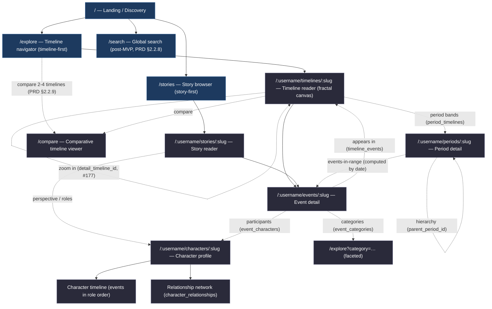

# Public Reader — Information Architecture + Route Model

Status: **draft 3** — all OQs resolved → ADR-0029 (route scheme), ADR-0030 (app placement); no visual styling, no motion detail
Parent epic: [#165](https://github.com/shaes-farm/time-traveler/issues/165) · Issue: [#166](https://github.com/shaes-farm/time-traveler/issues/166)
Scope owner: this document is the canonical IA contract that downstream public-reader design issues (#167–#173) and the visualization implementation tickets (#65–#69) build on.

> **What this document is.** The information architecture, route taxonomy, navigation model, and content-entry strategy for the **public reader** surface — the anonymous, read-only experience for consuming _published_ temporal content. It is deliberately distinct from the admin CMS IA in [`docs/design/admin/00-screen-inventory.md`](../admin/00-screen-inventory.md).
>
> **What this document is not.** Visual styling, high-fidelity comps, and motion/interaction timing are explicitly out of scope (they belong to #167, #171, #172). Where IA forces an interaction question (e.g. fractal drill paths), it is logged as an open question for the owning issue rather than resolved here.

---

## 1. Audience, principles, and the admin divergence

The public reader serves the **PRD §2.2 reader capabilities** for an **anonymous, unauthenticated** visitor (PRD §2.3.2: "Public content accessible without account. No authentication required for read-only access."). The data contract that makes this safe is the RLS publication model: every content table's `SELECT` policy leads with `published = true` (ADR-0011, ADR-0014, system-design §9.2), so the reader can only ever address published rows.

Five IA principles fall directly out of the product model and constrain everything below:

1. **Two entry philosophies, one content graph.** The PRD frames discovery two ways — _timeline-first_ (PRD §2.2.1 master timeline browsing, §2.2.2 fractal navigation) and _story-first_ (PRD §2.2.7 story reading). Both must be first-class top-level entry points; neither is subordinate.
2. **Temporal range is the spine.** Every entity is anchored in the hybrid temporal system (system-design §4) spanning five eras — CE, BCE, KYA, MYA, BYA. Era and precision travel with every date in the IA, never stripped to a bare year.
3. **The graph is fractal, not flat.** A timeline contains events; an event can expand into a sub-timeline (`events.detail_timeline_id`, ADR-0006, forward-only per #180). Navigation must preserve "where am I in the zoom stack" as a primary IA concern, not an afterthought.
4. **Seven character types are identity.** Human, Animal, Mythological, Fictional, Organization, Divine, Artifact (ADR-0007). Character type is a faceting and labeling axis throughout the reader, not just on the character page.
5. **Reader ≠ admin.** The admin surface is dense, keyboard-first, table-centric authoring chrome (admin aesthetic notes, _Tone and genre_). The reader is an immersive, scroll-and-zoom consumption surface. They **share design tokens but diverge in motion and composition**. The two must never share a navigation shell.

---

## 2. Information architecture map

**Reading the map:** solid arrows are primary navigation (a visible, deliberate "go here" affordance); dotted arrows are cross-links / lateral pivots between related entities. Entity routes use the `/:username/:type/:slug` scheme — see §4 and [ADR-0029](../../adr/adr-0029-public-reader-route-scheme.md).

---

## 3. Route taxonomy

The reader lives under the public route group `app/(public)/` (ADR-0003, system-design §11), which carries no auth requirement and is structurally separate from `(protected)` and `(admin)`. The public surface lives in the dedicated **`apps/reader`** Next.js application — see [ADR-0030](../../adr/adr-0030-public-reader-app-placement.md).

### 3.1 Primary routes

| Route                         | Surface             | Entity / query intent                                                                                 | Entry philosophy |
| ----------------------------- | ------------------- | ----------------------------------------------------------------------------------------------------- | ---------------- |
| `/`                           | Landing / discovery | Featured + recent published timelines and stories; dual call-to-action into both entry philosophies   | Both             |
| `/explore`                    | Timeline navigator  | Browse/filter published timelines; the master-timeline canvas entry (PRD §2.2.1)                      | Timeline-first   |
| `/:username/timelines/:slug`  | Timeline reader     | Fractal zoomable canvas for one timeline; events, period bands, character overlays (PRD §2.2.2–2.2.3) | Timeline-first   |
| `/stories`                    | Story browser       | Browse/filter published stories (PRD §2.2.7)                                                          | Story-first      |
| `/:username/stories/:slug`    | Story reader        | Narrative prose + ordered events in story context (`story_events.sort_order`, #183)                   | Story-first      |
| `/:username/events/:slug`     | Event detail        | Full event reader view (PRD §2.2.4)                                                                   | Shared leaf      |
| `/:username/characters/:slug` | Character profile   | Biography + character timeline + relationship network (PRD §2.2.5)                                    | Shared leaf      |
| `/:username/periods/:slug`    | Period detail       | Hierarchy + overlaid timelines + computed events-in-range (PRD §2.2.6, ADR-0028)                      | Shared leaf      |
| `/search`                     | Global search       | Faceted full-text search across all published types — **post-MVP / stubbed at launch** (PRD §2.2.8)   | Cross-cutting    |
| `/compare`                    | Comparative viewer  | 2–4 published timelines aligned on a shared time axis (PRD §2.2.9); selected via `?t=` params         | Cross-cutting    |

### 3.2 Faceted / parameterized routes

Facets are **query parameters on the list surfaces**, not distinct routes — this keeps shareable, bookmarkable filter state and avoids a combinatorial route explosion. The facet vocabulary derives directly from schema-backed columns so every facet is query-cheap:

| Surface                      | Facet param     | Source                                                         | Notes                                                                                          |
| ---------------------------- | --------------- | -------------------------------------------------------------- | ---------------------------------------------------------------------------------------------- |
| `/explore`                   | `?type=`        | `timelines.timeline_type` (general/biographical/comparative)   | Single-select.                                                                                 |
| `/explore`                   | `?era=`         | derived from `sort_order_start`/`sort_order_end` bucketing     | CE/BCE/KYA/MYA/BYA bands; era is computed, not a stored column.                                |
| `/explore`                   | `?category=`    | `event_categories` → `categories.slug`                         | Category tags events only this pass (ADR-0028).                                                |
| `/explore`                   | `?character=`   | `event_characters` → character ref                             | Multi-select; repeated params = AND intersection (all must appear). OR mode deferred post-MVP. |
| `/stories`                   | `?narrator=`    | `stories.narrator_type` (first_person/third_person/omniscient) | Single-select.                                                                                 |
| `/stories`                   | `?perspective=` | `stories.perspective_character_id`                             | Filter by perspective character.                                                               |
| `/stories`                   | `?tag=`         | `stories.tags[]`                                               | Multi-select chips.                                                                            |
| `/:username/timelines/:slug` | `?scale=`       | `timelines.scale` default + user toggle                        | `logarithmic` (default for long spans) ↔ `linear` (PRD §2.2.3).                                |
| `/:username/timelines/:slug` | `?at=`          | a `sort_order_years` anchor                                    | Deep-link to a zoom/scroll position; spec owned by #171.                                       |

> **Facet strategy decision.** Facets stay in the URL query string (not path segments) so that (a) a filtered view is one shareable link, (b) the same list component serves all facet combinations, and (c) facets compose without a routing matrix. Path segments are reserved for _entity identity_, query params for _view state_.

### 3.3 Routes intentionally **not** in the public reader

- No `/dashboard`, `/library` import, `/notifications`, or any `create`/`edit` route — those are `(protected)`/`(admin)` admin-CMS concerns (system-design §11).
- No `/categories/:slug` reader page this pass — categories are a faceting taxonomy, not a destination (they have no `published` column; ADR-0028). Category links resolve to `/explore?category=…`.
- No `/media/:slug` reader page — media is rendered inline on its parent entity; access is governed by the parent (ADR-0016).

---

## 4. URL & reference conventions

### 4.1 The slug-uniqueness constraint (load-bearing)

Every content entity has a `slug VARCHAR(100)`, but the unique index is **composite on `(user_id, slug)`** — verified in [`supabase/migrations/00001_initial_schema.sql`](../../../supabase/migrations/00001_initial_schema.sql) (`timelines_slug_idx`, `events_slug_idx`, `characters_slug_idx`, `periods_slug_idx`, `stories_slug_idx`). Slugs are **not globally unique**. Two different authors can each own a published timeline with slug `space-race`.

**Consequence:** a bare-slug public route like `/timelines/space-race` is ambiguous and cannot deterministically resolve to one entity. The route model must carry an author-disambiguating component or a globally-unique handle. This was the single most important open decision in this document — **resolved: Option A** `/:username/:type/:slug` ([ADR-0029](../../adr/adr-0029-public-reader-route-scheme.md)).

### 4.2 Reference scheme (decided — ADR-0029)

**[ADR-0029](../../adr/adr-0029-public-reader-route-scheme.md)** records this decision. The table below documents the options that were evaluated.

| Option          | Shape                        | Notes                                                                                                                                 |
| --------------- | ---------------------------- | ------------------------------------------------------------------------------------------------------------------------------------- |
| **A ✅ chosen** | `/:username/timelines/:slug` | Human-readable; matches `(user_id, slug)` grain exactly; SEO-clean; natural author attribution. `profiles` world-readable (ADR-0014). |
| **B**           | `/timelines/:slug-:shortid`  | Rejected — opaque suffix noise; requires custom slug+id parser; no author attribution.                                                |
| **C**           | `/timelines/:uuid`           | Rejected — unreadable, poor SEO, discards the slug investment entirely.                                                               |

### 4.3 Conventions (independent of the OQ-1 choice)

- **Slugs are lowercase, hyphen-delimited, ≤100 chars**, generated from the entity title at author time (admin concern; the reader only consumes them).
- **Canonical, lowercase, trailing-slash-free** paths; mixed-case or legacy paths 301 to canonical.
- **Unpublished or non-existent refs return 404** — never leak existence of a private/draft entity (the RLS `published = true` clause already enforces this server-side; the reader must surface a clean 404, not a 403, to avoid confirming existence).
- **Facets are additive query params** (§3.2), order-insensitive, omitted when at default.

---

## 5. Navigation hierarchy & cross-linking rules

### 5.1 Global navigation

A single persistent public shell (distinct from the admin shell) with:

- **Primary nav:** `Explore` (timeline-first), `Stories` (story-first), `Search` (post-MVP). These are the two entry philosophies plus retrieval — nothing else competes at the top level.
- **Brand / home** affordance returns to `/`.
- **No auth-gated chrome** in the default reader shell. A single unobtrusive "Sign in" affordance may route to the admin/auth surface, but the reader never requires it.

### 5.2 Cross-linking rules (the lateral graph)

Cross-links are the dotted edges in §2. They are governed by these rules so wireframes (#170) and flows (#169) stay consistent:

1. **Every entity reference is a link to that entity's reader route** when the target is published; when unpublished, it renders as inert text (no dead links, no 404 traps). Junctions that surface cross-links: `event_characters`, `event_categories`, `timeline_events`, `period_timelines`, `story_events`, `story_characters`, `character_relationships`.
2. **Containment vs. decomposition are visually distinct affordances.** "This event _appears in_ timeline X" (`timeline_events`, lateral) reads differently from "zoom _into_ this event's sub-timeline" (`detail_timeline_id`, a drill deeper into the same fractal stack). The IA distinguishes them; the exact interaction is #171's.
3. **Character type travels with every character link** (icon + label + type, never icon-alone) per the admin's finalized type-identity rule (admin aesthetic notes, _Character type as identity_) — reused so reader and admin share the same type vocabulary.
4. **Era + precision travel with every temporal display** (system-design §4; admin `TemporalDisplay` semantics). The reader never renders a bare year where era is known.
5. **Breadcrumb reflects the fractal zoom stack, not the route tree.** On `/timelines/:ref`, "where am I" is a path through nested sub-timelines (timeline → event → sub-timeline → …), which the flat route tree cannot express. The zoom-stack breadcrumb model is an IA requirement here; its interaction/state-machine form is owned by #171.

### 5.3 Entry-path definitions

- **Timeline-first entry path:** `/` → `/explore` (filter by era/type/category/character) → `/:username/timelines/:slug` (fractal canvas) → zoom to events → `/:username/events/:slug` → lateral to `/:username/characters/:slug` or `/:username/periods/:slug`. This is the PRD §2.2.1→§2.2.2→§2.2.4 spine.
- **Story-first entry path:** `/` → `/stories` (filter by narrator/perspective/tag) → `/:username/stories/:slug` (read narrative) → ordered events in story context → `/:username/events/:slug`, with the story's perspective character reachable at `/:username/characters/:slug`. This is the PRD §2.2.7 spine.
- **The two paths reconverge** at the shared leaf entities (`/:username/events/:slug`, `/:username/characters/:slug`, `/:username/periods/:slug`), so a reader who arrived via a story can pivot into the timeline canvas of any event, and vice versa. Reconvergence at leaves is the mechanism that makes the dual-entry model coherent rather than two siloed apps.

---

## 6. Review against the visualization tickets (#65–#69)

This IA was checked against the timeline-visualization implementation tickets it must unblock. The route/IA decisions that each ticket depends on:

| Ticket | Visualization concern             | IA dependency satisfied here                                                                                                                                      |
| ------ | --------------------------------- | ----------------------------------------------------------------------------------------------------------------------------------------------------------------- |
| #65    | Renderer foundation               | `/:username/timelines/:slug` is the canvas host route; the renderer mounts inside the public shell (§3.1, §5.1).                                                  |
| #66    | Logarithmic scale                 | `?scale=` is the URL-addressable scale-mode param; `logarithmic` is the documented default for long spans (§3.2; PRD §2.2.3).                                     |
| #67    | Linear mode + toggle              | Same `?scale=` param carries `linear`; the toggle is view-state in the URL so a scale choice is shareable (§3.2). Toggle UX is #171.                              |
| #68    | Fractal zoom navigation           | `detail_timeline_id` drill path and the zoom-stack breadcrumb are IA-defined (§2, §5.2 rule 2, §5.2 rule 5); `?at=` anchors deep-links.                           |
| #69    | Period / character overlay layers | `period_timelines` bands → `/:username/periods/:slug`, and `event_characters` overlays → `/:username/characters/:slug` are defined cross-links (§2, §5.2 rule 1). |

**Gating reminder (from #165):** #65–#67 should not begin implementation until the interaction spec (#171) and mid-fidelity spec (#172) land; #68–#69 additionally require prototype-validation findings (#173). This IA supplies the route/navigation contract those specs refine — it does not itself unblock implementation.

---

## 7. Open questions & decisions (with owners)

| ID       | Question                                                                                                                             | Recommendation / conservative default                                                                                                | Owner (issue)           |
| -------- | ------------------------------------------------------------------------------------------------------------------------------------ | ------------------------------------------------------------------------------------------------------------------------------------ | ----------------------- |
| ~~OQ-1~~ | **Public reference scheme** — slugs are unique only per `(user_id, slug)`, so bare-slug routes are ambiguous (§4.1).                 | ✅ **Decided: Option A** `/:username/:type/:slug` — [ADR-0029](../../adr/adr-0029-public-reader-route-scheme.md).                    | ADR-0029                |
| ~~OQ-2~~ | **MVP scope of `/search`** — PRD §2.2.8 marks full-text search post-MVP. Is faceted browse on `/explore` + `/stories` the MVP floor? | ✅ **Decided:** facets on list routes for MVP; `/search` reserved and stubbed (404 / "coming soon").                                 | #168 (screen inventory) |
| ~~OQ-3~~ | **Comparative timelines route** — PRD §2.2.9 wants 2–4 aligned timelines. Own route or a mode of `/timelines`?                       | ✅ **Decided:** dedicated `/compare?t=…&t=…` route — keeps the fractal canvas clean (§3.1, §3.2).                                    | #169 (user flows)       |
| ~~OQ-4~~ | **Multi-character intersection** — `?character=` multi-select (PRD §2.2.8). One param repeated, or AND/OR semantics in UI?           | ✅ **Decided:** repeated `?character=` = AND intersection; OR deferred post-MVP. URL convention set (§3.2).                          | #171 (interaction spec) |
| ~~OQ-5~~ | **App placement** — does the public reader live in `apps/admin/app/(public)/` or a dedicated reader app?                             | ✅ **Decided:** dedicated `apps/reader` — [ADR-0030](../../adr/adr-0030-public-reader-app-placement.md).                             | ADR-0030                |
| ~~OQ-6~~ | **Real-time on the reader** — PRD §2.2.10 wants Realtime published-content updates. In MVP IA or deferred?                           | ✅ **Decided:** Realtime is in-scope at MVP; mid-fi spec (#172) owns which surfaces subscribe. IA designed to tolerate live inserts. | #172 (mid-fi spec)      |

---

## 8. Verification (issue #166 acceptance criteria)

- [x] **IA map diagram and route inventory produced** — §2 (Mermaid IA map), §3 (route taxonomy + facets).
- [x] **Navigation hierarchy and cross-linking rules documented** — §5 (global nav, cross-link rules, entry-path definitions).
- [x] **Timeline navigator and story browser entry paths defined** — §5.3 (timeline-first and story-first paths, reconvergence at leaf entities).
- [x] **Reader route model reviewed against #65–#69 requirements** — §6 (per-ticket IA dependency table + gating reminder).
- [x] **Open questions and decisions captured with owners** — §7 (OQ-1…OQ-6, each with a recommendation and owning issue).
- [x] **Artifact linked back to #165** — header + [`README.md`](README.md) index.
- [x] **IA decisions are actionable by downstream design/wireframe issues** — facet vocabulary, route taxonomy, cross-link rules, and the OQ owners hand off concretely to #167–#173.

> **Public vs. admin separation (epic #165 AC):** documented in §1 (principle 5), §3.3 (excluded admin routes), and the [`README.md`](README.md) audience-separation note — the reader and admin surfaces share design tokens but never share a navigation shell, and the reader exposes zero authoring routes.
