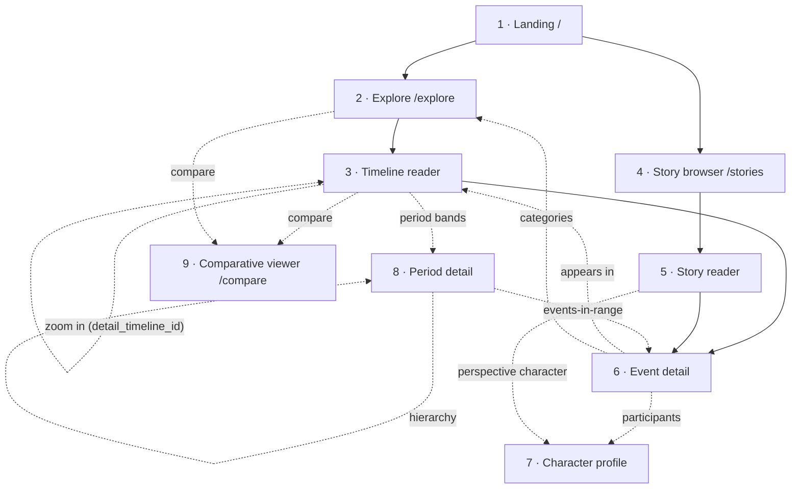

# Public Reader — Screen Inventory + Scope Map

Status: **draft 1** — screen enumeration + scope boundaries; no wireframes, no interaction detail
Parent epic: [#165](https://github.com/shaes-farm/time-traveler/issues/165) · Issue: [#168](https://github.com/shaes-farm/time-traveler/issues/168)
Builds on: [00 — IA + route model](00-ia-route-model.md) · [01 — UX principles + visual direction](01-ux-principles.md)

> **What this document is.** The canonical inventory of every screen in the **public reader** surface — the anonymous, read-only experience for consuming _published_ temporal content. For each screen it fixes the route target, purpose, primary modules, entry philosophy, MVP status, and the system states it must handle. It also draws the scope boundary against the admin CMS and maps the screens onto the timeline-visualization implementation tickets (#65–#69).
>
> **What this document is not.** It is not wireframes (those are #170), user flows (#169), interaction/state-machine detail (#171), or motion/visual comps (#172). Where a screen forces an interaction question, it is logged as a dependency for the owning issue rather than resolved here. Route shapes and the navigation graph are inherited verbatim from [00](00-ia-route-model.md) and are not re-litigated.

---

## 1. Scope boundary — reader vs. admin

The reader is a separate Next.js application (**`apps/reader`**, [ADR-0030](../../adr/adr-0030-public-reader-app-placement.md)) that **never shares a navigation shell** with the admin CMS ([00](00-ia-route-model.md) §1 principle 5). The two surfaces share design tokens but diverge sharply in motion and composition ([ADR-0031](../../adr/adr-0031-public-reader-design-divergence.md), [01](01-ux-principles.md) §4). This inventory therefore covers **only** anonymous, read-only consumption of published rows; everything authoring-related is out of scope and lives in [`docs/design/admin/00-screen-inventory.md`](../admin/00-screen-inventory.md).

**Explicitly not in this inventory** (per [00](00-ia-route-model.md) §3.3):

- **No authoring chrome.** No `create`/`edit`/`delete`, no dashboard, library import, notifications, or collaborator management — those are `(protected)`/`(admin)` concerns (system-design §11).
- **No sign-in-gated screens.** The reader requires no account ([00](00-ia-route-model.md) §1; PRD §2.3.2). A single unobtrusive "Sign in" affordance may deep-link _out_ to the admin/auth surface, but no reader screen sits behind auth.
- **No `/categories/:slug` page.** Categories are a faceting taxonomy, not a destination; category links resolve to `/explore?category=…` ([00](00-ia-route-model.md) §3.3, ADR-0028).
- **No `/media/:slug` page.** Media renders inline on its parent entity; access is governed by the parent (ADR-0016).

The safety contract underneath everything: every content table's `SELECT` policy leads with `published = true` (ADR-0011, ADR-0014, system-design §9.2), so the reader can only ever address published rows, and a missing/unpublished ref returns a clean **404, never a 403** ([00](00-ia-route-model.md) §4.3).

---

## 2. Screen inventory

The reader is built from a single persistent public shell plus the screens below. Routes, entry philosophy, and the navigation graph are inherited from [00](00-ia-route-model.md) §2–§3; primary components reference the shared `@repo/ui` primitives ([ADR-0020](../../adr/adr-0020-ui-package-shadcn-tailwind.md)) plus the reader-specific composites finalized in [01](01-ux-principles.md) §4–§6.

| #   | Screen              | Route                         | Purpose                                                                                                           | Primary modules / components                                                                                                                          | Entry philosophy | MVP status                 |
| --- | ------------------- | ----------------------------- | ----------------------------------------------------------------------------------------------------------------- | ----------------------------------------------------------------------------------------------------------------------------------------------------- | ---------------- | -------------------------- |
| 0   | Public app shell    | _wraps all routes_            | Persistent reader chrome distinct from the admin shell; hosts global nav + brand + the single "Sign in" deep-link | Top nav (`Explore` / `Stories` / `Search`), brand/home affordance, theme-fixed (dark-only, ADR-0023), footer, skip-to-content link                    | —                | **MVP**                    |
| 1   | Landing / discovery | `/`                           | Dual call-to-action into both entry philosophies; featured + recent published timelines and stories               | Hero with dual CTA (Explore / Stories), featured cards, recent-content rails, `TemporalDisplay` on each card                                          | Both             | **MVP**                    |
| 2   | Timeline navigator  | `/explore`                    | Browse/filter published timelines; the master-timeline entry (PRD §2.2.1)                                         | Filterable timeline grid/list, facet rail (`?type=` / `?era=` / `?category=` / `?character=`), result cards, sort control, pagination                 | Timeline-first   | **MVP**                    |
| 3   | Timeline reader     | `/:username/timelines/:slug`  | The fractal zoomable canvas for one timeline — events, period bands, character overlays (PRD §2.2.2–2.2.3)        | **Timeline canvas renderer (#65)**, zoom-stack breadcrumb, scale toggle (`?scale=`, #66/#67), period bands + character overlays (#69), event popovers | Timeline-first   | **MVP**                    |
| 4   | Story browser       | `/stories`                    | Browse/filter published stories (PRD §2.2.7)                                                                      | Filterable story grid, facet rail (`?narrator=` / `?perspective=` / `?tag=`), story cards (cover, narrator type, perspective character), pagination   | Story-first      | **MVP**                    |
| 5   | Story reader        | `/:username/stories/:slug`    | Read narrative prose with its ordered events in story context (`story_events.sort_order`, #183)                   | Long-form prose column, ordered event rail/inline anchors, perspective-character chip, narrator-type badge, lateral links to events/characters        | Story-first      | **MVP**                    |
| 6   | Event detail        | `/:username/events/:slug`     | Full event reader view (PRD §2.2.4); a shared leaf where both entry paths reconverge                              | Temporal range (`TemporalDisplay`), location, type/importance badges, participants (`event_characters`), categories, "appears in" + "zoom into" links | Shared leaf      | **MVP**                    |
| 7   | Character profile   | `/:username/characters/:slug` | Biography + character timeline + relationship network (PRD §2.2.5)                                                | Type-identity header (icon + label, 7 types), biography, character timeline (events in role order), relationship network (`character_relationships`)  | Shared leaf      | **MVP**                    |
| 8   | Period detail       | `/:username/periods/:slug`    | Period hierarchy + overlaid timelines + computed events-in-range (PRD §2.2.6, ADR-0028)                           | Period header + `TemporalDisplay` span, hierarchy breadcrumb (`parent_period_id`), overlaid timelines (`period_timelines`), events-in-range list      | Shared leaf      | **MVP**                    |
| 9   | Comparative viewer  | `/compare`                    | 2–4 published timelines aligned on a shared time axis (PRD §2.2.9); selected via `?t=` params                     | Multi-track aligned axis, per-track renderer instance (#65), shared scale control, track add/remove picker                                            | Cross-cutting    | **MVP-optional** (stretch) |
| 10  | Global search       | `/search`                     | Faceted full-text search across all published types (PRD §2.2.8)                                                  | Search input, result list grouped by type — **stubbed at launch** ("coming soon" / 404 placeholder)                                                   | Cross-cutting    | **Post-MVP / stubbed**     |
| 11  | Not found           | `404`                         | Clean catch-all for missing or unpublished refs; never confirms existence of a private/draft entity               | 404 message, return-home + explore affordances; **no 403 path** ([00](00-ia-route-model.md) §4.3)                                                     | —                | **MVP**                    |

**MVP floor (decided, [00](00-ia-route-model.md) OQ-2):** screens 0–8 + 11 are the launch set; screen 9 (`/compare`) is MVP-optional (stretch); screen 10 (`/search`) is reserved and stubbed at launch. Faceted browse on `/explore` and `/stories` is the search floor for MVP.

---

## 3. System states (per primary screen)

Every primary screen must define four runtime states. Visual/motion treatment is owned by [01](01-ux-principles.md) §6 and #172; this table fixes _which_ states each screen must handle and the conservative default behavior.

| Screen               | Empty                                                                 | Loading                                           | Error                                                          | Connection-loss (Realtime)                                                       |
| -------------------- | --------------------------------------------------------------------- | ------------------------------------------------- | -------------------------------------------------------------- | -------------------------------------------------------------------------------- |
| Landing (`/`)        | No published content yet → friendly "nothing published" + Explore CTA | Skeleton rails for featured/recent                | Retryable error panel; shell stays intact                      | Stale-content banner; auto-resubscribe on reconnect                              |
| Explore (`/explore`) | No matches for active facets → "clear filters" affordance             | Skeleton grid; facet rail interactive immediately | Retryable error region; facets preserved in URL                | Banner on dropped subscription; new published rows merge on reconnect            |
| Timeline reader      | Timeline with no events → empty canvas with span context              | Canvas skeleton + progressive event hydration     | Renderer-scoped error boundary; rest of shell usable           | "Live updates paused" banner; resubscribe + re-fetch visible window on reconnect |
| Story browser        | No published stories / no facet matches → empty state + clear-filters | Skeleton story cards                              | Retryable error region                                         | Stale banner; auto-resubscribe                                                   |
| Story reader         | Story with no ordered events → prose-only render (valid)              | Prose + event-rail skeletons                      | Retryable error; narrative content cached where already loaded | Stale banner; resubscribe                                                        |
| Event detail         | Sparse event (no participants/categories) → sections gracefully omit  | Section skeletons                                 | 404 if unpublished/missing; retryable for transient errors     | Stale banner; resubscribe                                                        |
| Character profile    | Character with no events/relationships → identity-only render         | Header + timeline/network skeletons               | 404 if unpublished/missing; retryable transient                | Stale banner; resubscribe                                                        |
| Period detail        | Period with no overlaid timelines / events-in-range → header-only     | Hierarchy + lists skeletons                       | 404 if unpublished/missing; retryable transient                | Stale banner; resubscribe                                                        |
| Comparative viewer   | Fewer than 2 valid tracks → prompt to add timelines                   | Per-track skeletons                               | Per-track error isolation; one bad track doesn't sink others   | Per-track stale indicator; resubscribe per track                                 |
| Global search        | Stubbed → "coming soon" placeholder is the only state at launch       | n/a (stub)                                        | n/a (stub)                                                     | n/a (stub)                                                                       |

**Connection-loss scope (decided — this pass).** Reader screens that subscribe to Realtime published-content updates (in-scope at MVP, [00](00-ia-route-model.md) OQ-6; PRD §2.2.10) must degrade gracefully: a lightweight **stale-content banner** plus **automatic resubscribe + re-fetch of the visible window** on reconnect. **Full offline / PWA caching is out of scope** for this pass — the reader is an anonymous, SSR-first surface, so server-render already covers the cold-load path; only the live-update layer needs a reconnect story. The exact banner copy, timing, and reduced-motion behavior are owned by [01](01-ux-principles.md) §6 (`ambient-presence`) and #172.

---

## 4. Cross-screen dependencies

The reader is a dual-entry graph that reconverges at shared leaves ([00](00-ia-route-model.md) §5.3). The screen-level edges below restate that graph as navigation dependencies so #169 (flows) and #170 (wireframes) decompose without ambiguity. Edge semantics follow [00](00-ia-route-model.md) §5.2 (solid = primary nav, dotted = lateral cross-link).

**Reconvergence (load-bearing):** the timeline-first and story-first paths both terminate at the shared leaves — Event detail (6), Character profile (7), Period detail (8) — so a reader who arrived via a story can pivot into the timeline canvas of any event, and vice versa ([00](00-ia-route-model.md) §5.3). Every entity reference is a link to that entity's reader route when published, and inert text when not (no dead links; [00](00-ia-route-model.md) §5.2 rule 1).

---

## 5. Visualization-ticket touchpoints (#65–#69)

This inventory is checked against the timeline-visualization implementation tickets it must enable. Each ticket is hosted by specific screens; this fixes _where_ each lands so wireframes and the interaction spec target the right surfaces.

| Ticket | Visualization concern             | Hosting screen(s)                       | Inventory touchpoint                                                                                           |
| ------ | --------------------------------- | --------------------------------------- | -------------------------------------------------------------------------------------------------------------- |
| #65    | Renderer foundation               | 3 Timeline reader; 9 Comparative viewer | The canvas renderer is the primary module of screen 3 and instanced per-track in screen 9.                     |
| #66    | Logarithmic scale                 | 3 Timeline reader                       | `?scale=logarithmic` is the long-span default; scale toggle is a primary module of screen 3 (§2).              |
| #67    | Linear mode + toggle              | 3 Timeline reader; 9 Comparative viewer | Same `?scale=` toggle carries `linear`; comparative viewer shares one scale control across tracks.             |
| #68    | Fractal zoom navigation           | 3 Timeline reader                       | Zoom-stack breadcrumb + `detail_timeline_id` drill (the `TL → TL` self-edge in §4) are screen-3 modules.       |
| #69    | Period / character overlay layers | 3 Timeline reader                       | Period bands (`period_timelines`) and character overlays (`event_characters`) are overlay modules on screen 3. |

**Gating reminder ([00](00-ia-route-model.md) §6, #165):** #65–#67 must not begin implementation until the interaction spec (#171) and mid-fidelity spec (#172) land; #68–#69 additionally require prototype-validation findings (#173). This inventory supplies the screen-hosting contract those specs refine — it does not itself unblock implementation.

---

## 6. Handoff

What the downstream issues take from this inventory:

| Issue | Artifact                     | Consumes from this inventory                                                                             |
| ----- | ---------------------------- | -------------------------------------------------------------------------------------------------------- |
| #169  | User flows                   | §2 screen set + §4 dependency graph as the nodes/edges of each flow; §2 MVP status to scope flows.       |
| #170  | Low-fidelity wireframes      | §2 primary-modules column (one wireframe per screen) + §3 system states (one frame per state).           |
| #171  | Interaction specification    | §3 connection-loss/Realtime behavior, the zoom-stack drill (§4 self-edge), scale toggle, facet behavior. |
| #172  | Mid-fidelity + motion + a11y | §3 state catalog as the motion/empty/loading surfaces to comp; §5 renderer-bearing screens.              |
| #173  | Prototype validation         | The MVP-floor screen set (§2) as the surfaces to validate end-to-end.                                    |

---

## 7. Verification (issue #168 acceptance criteria)

- [x] **Inventory includes the timeline-navigator + story-browser core screens** — §2 rows 2 (`/explore`) and 3 (timeline reader) for the navigator; rows 4 (`/stories`) and 5 (story reader) for the browser; plus the shared leaves and shell.
- [x] **Each screen has purpose, key modules, and route target** — §2 table columns (Purpose, Primary modules / components, Route).
- [x] **System states defined per primary screen** — §3 (empty / loading / error / connection-loss) for every primary screen.
- [x] **Dependency notes include #65–#69 touchpoints** — §5 maps each visualization ticket to its hosting screen(s); §4 captures cross-screen navigation dependencies.
- [x] **Scope boundaries vs. the admin app explicitly stated** — §1 (separate app, no shared shell, no authoring chrome, explicit exclusions).

**Verification checks (from #168):**

- [x] **Links to the IA + UX-principles artifacts** — header + inline references to [00](00-ia-route-model.md) and [01](01-ux-principles.md) throughout.
- [x] **Enables wireframe (#170) decomposition without ambiguity** — §2 fixes one screen per wireframe and §3 fixes the per-screen state frames; §6 records the handoff explicitly.
