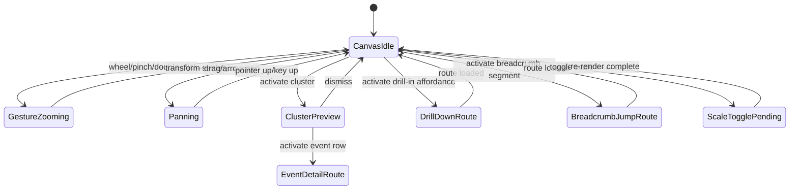

# Public Reader — Interaction Specification

Status: **draft 1** — interaction and state-machine contract for timeline + story-browser behavior
Parent epic: [#165](https://github.com/shaes-farm/time-traveler/issues/165) · Issue: [#171](https://github.com/shaes-farm/time-traveler/issues/171)
Builds on: [00 — IA + route model](00-ia-route-model.md) · [01 — UX principles](01-ux-principles.md) · [02 — Screen inventory](02-screen-inventory.md) · [03 — User flows](03-user-flows.md) · [04 — Wireframes](04-wireframes/)

> What this document is: the strict interaction and behavior contract for public-reader timeline and story-browser interactions. It defines input mappings, state machines, threshold rules, reduced-motion behavior, and testable contracts for #65-#69.
>
> What this document is not: implementation code, rendering-engine internals, visual polish timing/choreography (owned by #172), or backend query redesign.

---

## 1. Scope and constraints

In scope (from #171):

- Zoom model: wheel, pinch, double-click, reset.
- Scale behavior: logarithmic/linear toggle rules.
- Semantic zoom: detail levels and label density.
- Story-browser pivot and return-context behavior.
- Input modalities: mouse, touch, keyboard.
- Reduced-motion fallback behavior.

Out of scope:

- D3 implementation details.
- Backend query changes (unless tracked as follow-up issues).

Hard constraints inherited from prior artifacts:

- URL and route contracts from [00](00-ia-route-model.md).
- Accessibility baseline from [01](01-ux-principles.md) section 7.
- Screen-level states from [02](02-screen-inventory.md) section 3.
- Flow-level outcomes from [03](03-user-flows.md).

---

## 2. Interaction model overview

The reader has two interaction spines that reconverge at shared leaf entities:

- Timeline spine: explore -> timeline canvas -> event/period/character pivots.
- Story spine: stories -> story reader -> event/character pivots.

The timeline canvas is governed by four coordinated subsystems:

- Viewport transform state (pan/zoom).
- Scale mode state (logarithmic/linear).
- Semantic detail level state.
- Focus/selection state (event, cluster, breadcrumb segment).

---

## 3. Timeline state machine (normative)

### 3.1 Core state fields

The public timeline interaction state MUST expose the following conceptual fields:

- activeTimelineRef: timeline route identity.
- zoomDepth: integer >= 1 (root = 1).
- scaleMode: logarithmic | linear.
- viewportCenter: time anchor in sort-order units.
- viewportZoom: positive scalar.
- semanticLevel: L0 | L1 | L2 | L3.
- selectedEntity: null | cluster | event.
- reducedMotion: boolean from prefers-reduced-motion.

### 3.2 Allowed transitions

1. Zoom input updates viewportZoom and viewportCenter.
2. viewportZoom crossing thresholds updates semanticLevel.
3. Scale toggle updates scaleMode and preserves viewportCenter anchor.
4. Drill-in route push increments zoomDepth and resets selectedEntity.
5. Breadcrumb jump route push sets zoomDepth to selected ancestor depth.
6. Reset zoom sets zoomDepth to 1 on the current timeline stack root.

### 3.3 Guard rails

- Zoom depth cannot be less than 1.
- Drill-in is only available when event.detail_timeline_id is present.
- Breadcrumb jump targets only current-stack ancestors.
- Scale toggle does not change current route path, only query state.
- Selection is cleared on route-level transitions.

---

## 4. Zoom behavior specification

### 4.1 Input mapping

Mouse and trackpad:

- Wheel over canvas: continuous zoom around pointer anchor.
- Shift+wheel or horizontal wheel: pan horizontally.
- Double-click on empty canvas: step zoom-in centered at pointer.
- Double-click on event marker: step zoom-in and select event.

Touch:

- Pinch: continuous zoom around midpoint anchor.
- One-finger drag: pan.
- Double-tap on empty canvas: step zoom-in.
- Double-tap on selected event: open event detail.

Keyboard:

- = or +: step zoom-in around current focus anchor.
- -: step zoom-out around current focus anchor.
- Arrow keys: pan by fixed viewport fraction.
- Shift + Arrow keys: pan by larger viewport fraction.
- 0: reset zoom to timeline-root extent.

### 4.2 Step and clamp rules

- Step zoom delta for discrete actions (double-click, +/- keys): 1.25x scale multiplier.
- Continuous zoom (wheel/pinch) accumulates into equivalent scalar multiplier.
- Global clamp: viewportZoom MUST remain in [0.25x, 256x].
- At clamp edges, further zoom input is ignored and no bounce animation is required.

### 4.3 Anchor preservation

- For wheel/pinch/double-click, anchor point remains visually stable through transform.
- For keyboard zoom, focus anchor precedence: selected event -> keyboard focus target -> viewport center.
- For reset, anchor is ignored and root fit wins.

### 4.4 Reset behavior

- Reset control and keyboard 0 produce the same outcome:
  - active timeline route unchanged.
  - viewport fitted to the current timeline root extent.
  - semanticLevel recalculated from fitted zoom.
  - selectedEntity cleared.

---

## 5. Scale mode behavior (logarithmic vs linear)

### 5.1 Defaults and persistence

- Default scale mode on timeline entry: logarithmic.
- scaleMode persists in URL query via `?scale=logarithmic` (default) or `?scale=linear`.
- Invalid `?scale` values are coerced to logarithmic.

### 5.2 Toggle contract

On toggle:

1. Keep active route path unchanged.
2. Preserve viewportCenter temporal anchor.
3. Recompute x-position mapping by chosen scale function.
4. Recompute semanticLevel from post-toggle zoom density.
5. Maintain selection only if selected entity remains visible; otherwise clear selection.

### 5.3 Edge-case rules

- Extremely long spans in linear mode are allowed; no forced fallback.
- If precision loss causes marker overlap spikes, cluster rules apply (section 7), not automatic mode switch.
- Shared compare-view tracks (if enabled) must use one global scale mode.

---

## 6. Semantic zoom levels and label density

Semantic level is derived from visible years-per-1000px (YPP) after transforms.

- L0 (macro): YPP > 10,000,000
- L1 (era): 100,000 < YPP <= 10,000,000
- L2 (period/event): 1,000 < YPP <= 100,000
- L3 (detail): YPP <= 1,000

### 6.1 Visibility by level

- L0: timeline spine, major era bands, high-importance markers only, no event labels.
- L1: period bands + top-priority event markers, sparse labels.
- L2: standard event markers, cluster affordances, selective labels.
- L3: dense event labels, secondary metadata chips, precise temporal markers.

### 6.2 Label-density ceilings

To prevent illegible clutter:

- Max labels per 1000px lane:
  - L1: 8
  - L2: 18
  - L3: 36
- Overflow beyond ceiling degrades to marker-only representation.
- Overlapping labels at same priority are suppressed by nearest-neighbor culling.

### 6.3 Importance bias

When density culling is required:

1. Higher importance wins.
2. More precise temporal value wins over broader ranges.
3. Stable tiebreak by deterministic event id order.

---

## 7. Cluster interaction behavior

Cluster is defined as >1 event whose marker centers fall within an 18px radius at current transform.

### 7.1 Cluster affordance

- Cluster renders as aggregate marker with count badge.
- Entering cluster hover/focus reveals summary tooltip.
- Activation opens cluster preview panel anchored to cluster marker.

### 7.2 Cluster preview panel

- Shows up to first 25 events, sorted by importance then temporal order.
- If more than 25, panel shows "+N more" with pagination controls.
- Selecting a row routes to event detail.

### 7.3 Keyboard and touch

- Keyboard: Enter/Space on focused cluster opens panel; Escape closes.
- Touch: tap cluster opens panel; tap outside closes.

---

## 8. Fractal drill-in and breadcrumb behavior

### 8.1 Drill-in affordance

- Event drill-in affordance appears only when detail_timeline_id exists.
- Activating drill-in routes to child timeline and pushes stack depth.
- On arrival, viewport starts with fit-to-child-root behavior.

### 8.2 Breadcrumb model

- Breadcrumb represents zoom stack hierarchy, not route tree.
- Each crumb is an ancestor timeline segment.
- Activating crumb routes directly to that ancestor timeline.

### 8.3 Truncation rule

- Up to 3 segments shown inline.
- At depth >= 4, middle segments collapse into expandable ellipsis control.
- Ellipsis popover lists hidden ancestor segments in order.

### 8.4 Back/forward behavior

- Browser back/forward must replay route stack transitions.
- Focus restoration after route transition:
  - primary target: main heading of destination timeline.
  - secondary target (if keyboard-triggered): breadcrumb control that initiated navigation.

---

## 9. Story-browser pivot and return-context rules

### 9.1 Story -> Event pivot

From story reader:

- Activating an event rail item routes to event detail.
  - Event route carries return context query: `?from=story&story=<story-ref>&storyPos=<rail-index>`

### 9.2 Event -> Story return

If event route has story return context:

- Show Return to story action in event detail header.
- Activation returns to story route and restores rail scroll/focus at storyPos.

### 9.3 Event -> Timeline pivot

From event detail "appears in" timeline link:

- Route to timeline with optional anchor query ?at=<event-anchor>.
- Canvas should center event marker if anchor resolves; otherwise fallback to timeline root fit.

### 9.4 Character and period lateral pivots

- Event -> Character and Event -> Period pivots use context-shift transition class.
- No automatic "return stack" is implied unless explicit query context exists.

---

## 10. Accessibility interaction patterns

### 10.1 Keyboard traversal contract

- All interactive controls in canvas shell reachable via Tab.
- Canvas internal keyboard interactions available when canvas has focus.
- Escape closes the highest-priority open overlay/panel.
- Focus ring is always visible and never removed for pointer users.

### 10.2 Screen-reader behavior

- Canvas exposes keyboard-help hint via aria-describedby.
- Zoom level and scale mode changes announce via polite live region.
- Cluster panel opening announces event count and available actions.

### 10.3 Reduced-motion behavior

When prefers-reduced-motion is true:

- All fractal-zoom transitions become instant state swaps.
- No camera-flight interpolation between breadcrumb jumps.
- Scale toggle uses direct redraw with no fade animation.
- Live update indicators are static, no pulse/blink.

### 10.4 Input parity

Equivalent outcomes across modalities are required:

- Mouse, touch, and keyboard can each perform zoom-in, zoom-out, pan, reset, cluster open, drill-in, and breadcrumb jump.

---

## 11. Error, empty, and connection-loss behavior

- Missing/unpublished targets always resolve to 404 route.
- Empty timeline still supports zoom/pan and reset controls.
- Connection loss shows non-blocking stale-content banner.
- Reconnect triggers visible-window refetch; interaction state is preserved where possible.

---

## 12. Testable acceptance criteria for #65-#69

### 12.1 #65 renderer foundation

- Given a timeline route, when canvas loads, then keyboard zoom/pan/reset actions modify viewport state as specified.
- Given reduced-motion preference, when drill-in or breadcrumb jump occurs, then no animated interpolation occurs.

### 12.2 #66 logarithmic scale

- Given initial timeline entry, when no scale query is present, then scaleMode is logarithmic.
- Given toggle to logarithmic from linear, then viewportCenter temporal anchor is preserved.

### 12.3 #67 linear toggle

- Given scale toggle action, when scale changes, then URL query updates to valid ?scale value.
- Given invalid scale query, then rendered mode is logarithmic.

### 12.4 #68 fractal navigation

- Given event with detail_timeline_id, when drill-in is activated, then route changes to child timeline and breadcrumb depth increments.
- Given breadcrumb ancestor activation, then route changes to selected ancestor and depth reflects selected level.
- Given depth >= 4, then breadcrumb truncates with expandable ellipsis behavior.

### 12.5 #69 period and character overlays

- Given semantic level changes, period band and event overlay visibility follows level rules in section 6.
- Given marker overlap beyond cluster threshold, cluster affordance appears and panel behavior follows section 7.

---

## 13. Follow-up ambiguities and issue handoff

The following are intentionally deferred and should be tracked as follow-ups if not already covered:

1. Exact motion duration/easing values and choreography polish: #172.
2. Cluster panel pagination UX details (page size controls, virtualized scrolling): #172 or implementation ticket under #69.
3. Compare-view shared-axis keyboard map finalization if /compare is included at MVP: follow-up under #67.
4. Screen-reader verbosity tuning for high-frequency zoom updates: follow-up accessibility task under #172.

---

## 14. Verification against issue #171

- [x] Interaction state machine documented (sections 2-3).
- [x] Zoom/scale behaviors include thresholds and edge-case rules (sections 4-6).
- [x] Story pivot and return-context behaviors defined (section 9).
- [x] Accessibility interaction patterns included (section 10).
- [x] Testable behavioral acceptance criteria provided for engineering issues (section 12).
- [x] #65-#69 can reference this doc directly for behavior contracts (section 12 mapping).
- [x] Remaining ambiguities logged as follow-up tasks (section 13).
